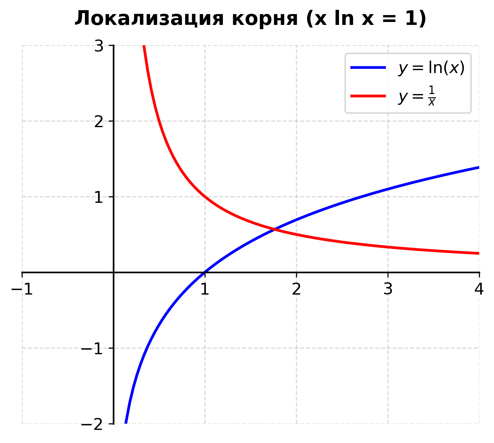
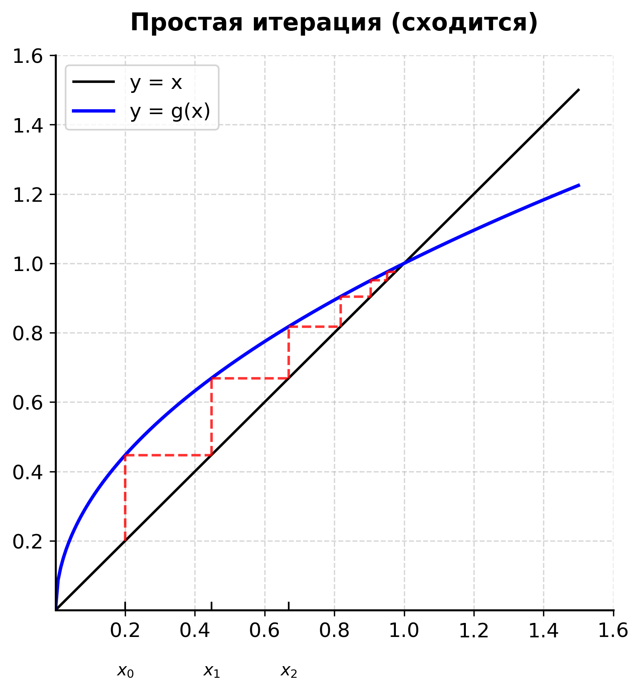
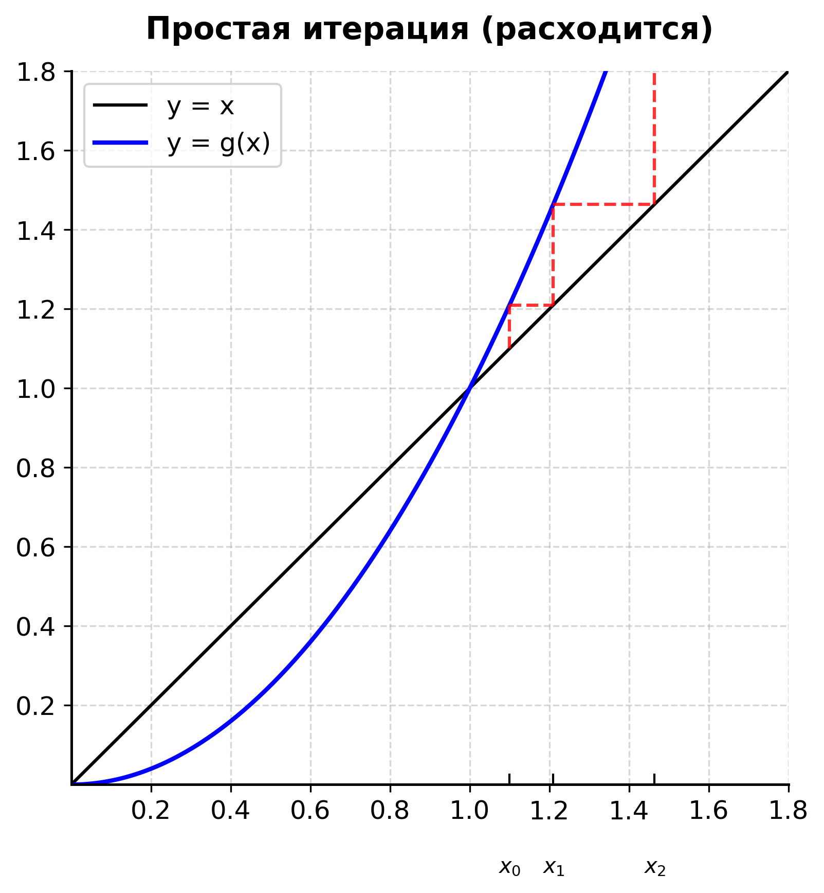
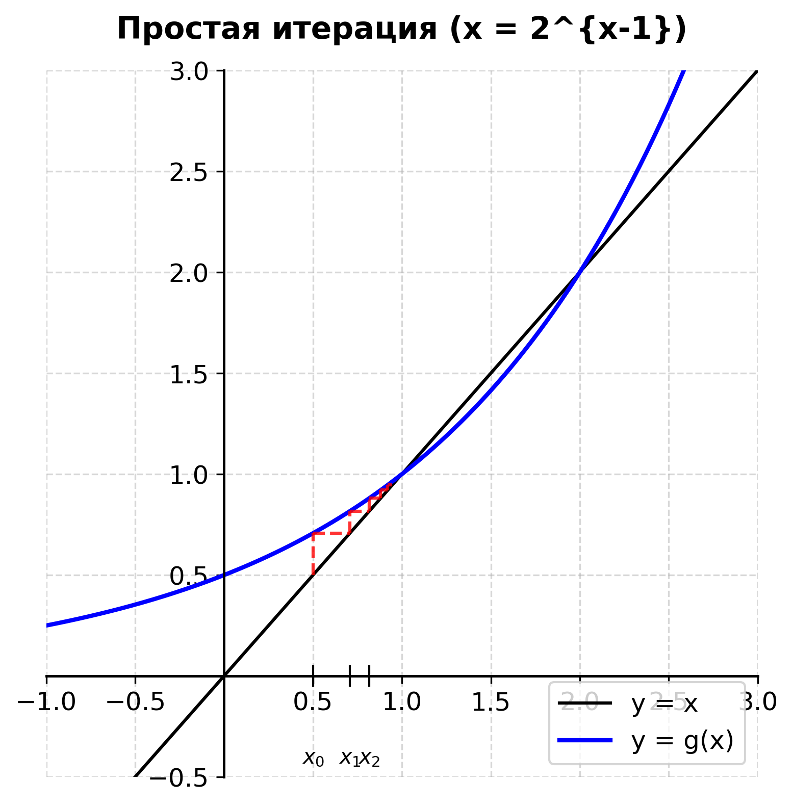
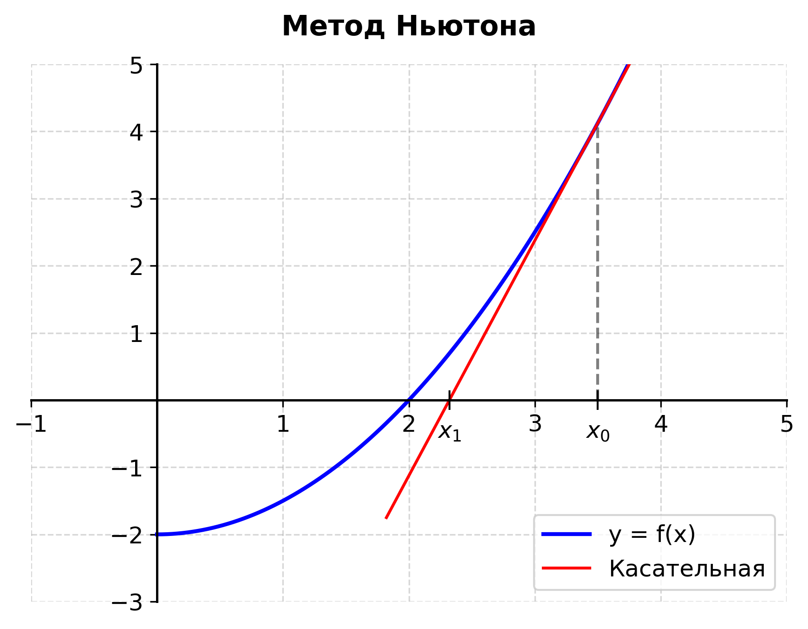
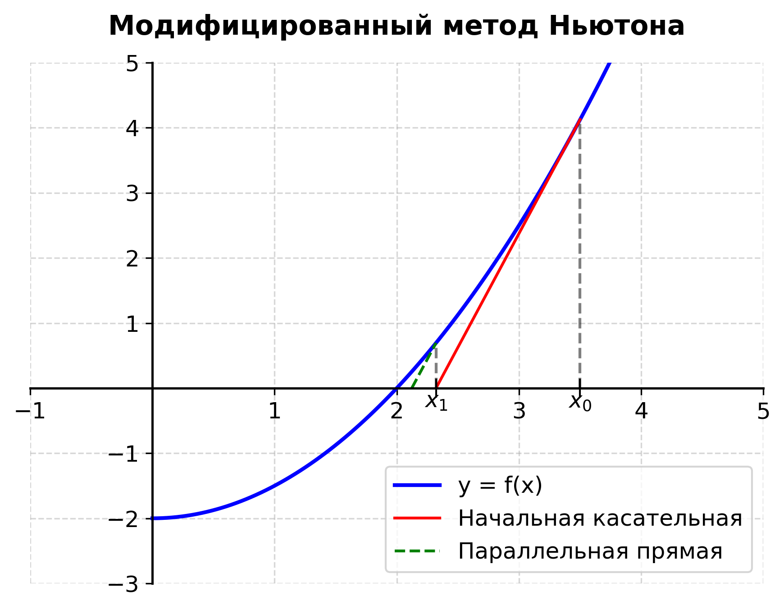

# Численные методы: Устойчивость задач и решение нелинейных уравнений

## Устойчивость задач

Некоторые задачи очень чувствительны к изменению параметров. Эта чувствительность характеризуется понятием устойчивости.

Пусть в результате решения задачи по исходному значению величины $x$ найдено значение искомой величины $y$. Обозначим:

* $\Delta(x)$ — абсолютные погрешности величины $x$
* $\Delta(y)$ — абсолютные погрешности величины $y$

**Опр.** Задача называется **устойчивой** по исходному параметру $x$, если решение $y$ непрерывно зависит от него, т.е. малое приращение $\Delta(x)$ приводит к малому приращению $\Delta(y)$.

**Замечание.** Отсутствие устойчивости: малые погрешности в исходных данных приводят к большим погрешностям в решении или к неверному решению.

### Примеры:

**1.** Задан полином:

$$P(x) = (x-1)(x-2)...(x-20) = x^{20} - 210x^{19} + ...$$

Слегка изменим один коэффициент:

$$\tilde{P}(x) = x^{20} - (210 + 2^{-23})x^{19} + ...$$

Т.е. $\tilde{P}(x) = P(x) + 2^{-23}x^{19}$

Какое воздействие произведёт это малое изменение на корни?
Корни исходного $P(x)$: $x_n = n; \ n = 1, 20$
Корни изменённого $\tilde{P}(x)$:
$x_n = n; \ n = 1, ..., 7$ (первые 7 корней почти не изменились)
$x_8 = 8,007 \quad x_9 = 8,917 \quad x_{10,11} = 10,095 \pm 0,643i$
$... \quad x_{19} = 19,5 + 1,94i \quad x_{20} = 20,847$
**Вывод:** Задача неустойчива.

> 💡 **Объяснение:** Это классический пример, который называется **полиномом Уилкинсона**. Он показывает, что нахождение корней многочленов высоких степеней — крайне неустойчивая задача. Изменение коэффициента на ничтожно малую величину ($2^{-23} \approx 0.0000001$) привело к тому, что действительные корни превратились в комплексные числа с большой мнимой частью.

**2.** Вычисление интеграла:

$$E_n = \int_0^1 x^n e^{x-1} dx; \quad n = 1, 2, ...$$

Известно, что $E_1 > E_2 > ... > E_n > 0$ и $\lim_{n \to \infty} E_n = 0$.

Вычислим по частям:

$$E_n = \int_0^1 x^n e^{x-1} dx = x^n e^{x-1} \Big\vert{}_0^1 - \int_0^1 e^{x-1} n x^{n-1} dx = 1 - n \int_0^1 x^{n-1} e^{x-1} dx = 1 - n E_{n-1}$$

Получили рекуррентную формулу: $E_n = 1 - n E_{n-1}$
Начальное значение: $E_1 = \frac{1}{e}$

Если считать так, то погрешность увеличивается с каждым шагом (из-за умножения на $n$).
Перепишем формулу:

$$E_{n-1} = \frac{1 - E_n}{n}; \quad n = 105, ..., 100, ..., 3, 2$$

Если начнём вычисления с некоторого $E_n$ (возьмём $E_{105} = 0$) и будем двигаться в обратном порядке, то любая начальная ошибка / промежуточные погрешности будут уменьшаться.

> 💡 **Объяснение:** Это пример того, как правильный выбор алгоритма делает вычисления устойчивыми. В прямой формуле мы на каждом шаге умножаем предыдущую ошибку на $n$. Если $n=100$, ошибка возрастает колоссально. В обратной формуле мы делим на $n$, тем самым "гася" ошибку с каждым шагом, поэтому даже если мы просто угадаем, что $E_{105} = 0$, к $E_1$ мы придем с идеальной точностью.

---

## Корректность и сходимость

**Опр.** Задача называется **корректно поставленной**, если для значений исходных данных из некоторого класса её решение существует, единственно и устойчиво по исходным данным.

Сходимость характеризует близость полученного численного решения задачи к истинному решению.
Пусть $\lim_{n \to \infty} x_n = a$.

**Опр.** Сходимость **линейная**, если $\exists N \in \mathbb{Z}: \forall n \ge N$

$$\vert{}a - x_{n+1}\vert{} \le q \vert{}a - x_n\vert{}; \quad 0 < q < 1$$

**Опр.** Скорость сходимости имеет **порядок** $s > 1$, если $\exists N \in \mathbb{Z}: \forall n \ge N$

$$\vert{}a - x_{n+1}\vert{} \le C \cdot \vert{}a - x_n\vert{}^s; \quad C = const > 0$$

---

## Решения нелинейных уравнений

Пусть дано уравнение $f(x) = 0$.
$f(x)$ определена и непрерывна на некотором (бес)конечном промежутке.
Число $r$: $f(r) = 0$ — корень/ноль функции $f(x)$.
Предполагаем, что уравнение $f(x) = 0$ имеет лишь изолированные корни.

### Нахождение корней делится на 2 этапа:

1. **Локализация:** Указать достаточно малый промежуток $(a, b)$, в котором $\exists$ только один корень.
2. **Уточнение:** Довести корни до заданной степени точности.

**Теорема Больцано-Коши:**
Если непрерывная функция $f(x)$ принимает значения разных знаков на концах отрезка $[a, b]$, то внутри этого отрезка $\exists$ хотя бы один корень.

**Замечание.** Корень будет единственным, если $\exists f'(x)$ и сохраняет знак в $(a, b)$ (т.е. функция строго монотонна).

### Примеры локализации:

**1.** $x^3 - 2x^2 - 1 = 0$
$f(1) < 0 \quad f(2) < 0$
$f(3) > 0$
Корней всего 3 (по степени). Действительных корней 1 или 3. В данном случае 1 (он находится между 2 и 3, т.к. знак меняется с минуса на плюс).

**2.** $x \ln x = 1 \Rightarrow \ln x = \frac{1}{x}$
Строим графики $y = \ln x$ и $y = 1/x$. Их точка пересечения и есть корень.

---

## Метод половинного деления (Дихотомии)

Пусть функция $f(x)$ определена и непрерывна на $[a, b]$.
$f(a)f(b) < 0$ (значения на концах разных знаков).
Предположим $a_0 = a$ и $b_0 = b$.

1. Возьмём середину: $x_0 = \frac{a_0 + b_0}{2}$.
2. Если $f(x_0) = 0$, то $x_0$ — корень уравнения.
3. Если $f(x_0) \neq 0$, то выбираем тот из отрезков $[a_0, x_0]$ и $[x_0, b_0]$, на концах которого $f(x)$ имеет противоположные знаки.

Полученный отрезок $[a_1, b_1]$ делим пополам и проделываем ту же операцию. Продолжая процесс, получаем либо точный корень уравнения, либо бесконечную последовательность вложенных отрезков:
$[a_0, b_0] \supset [a_1, b_1] \supset ... \supset [a_n, b_n] \supset ...$;
$f(a_n)f(b_n) < 0; \quad n = 0, 1, ...$
Длина отрезка на шаге $n$:

$$b_n - a_n = \frac{b - a}{2^n}$$

Левые границы растут, правые убывают:
$a_0 \le a_1 \le ... \le a_n \le ... < b$
$b_0 \ge b_1 \ge ... \ge b_n \ge ... > a$

В силу известных теорем (Вейерштрасса): $\lim_{n \to \infty} a_n = r_1$ и $\lim_{n \to \infty} b_n = r_2$.
Перейдём к пределу для длин: $\lim_{n \to \infty} b_n - \lim_{n \to \infty} a_n = 0$.
Тем самым: $r_1 = r_2 = r$.
Переходя к пределу для знаков ($f(a_n)f(b_n) < 0$): $f^2(r) \le 0 \Rightarrow f(r) = 0$.
Т.е. $r$ — корень $f(x)$.

Оценка погрешности:

$$x_n = \frac{a_n + b_n}{2}; \quad \vert{}r - x_n\vert{} \le \frac{b - a}{2^{n+1}}$$

(Лучше делать $c = a + \frac{b - a}{2}$, чтобы избежать переполнения типов в программировании)

---

## Метод простой итерации

Пусть нелинейное уравнение представлено в виде $x = g(x)$.
Формула метода простой итерации:

$$x_{n+1} = g(x_n); \quad n = 0, 1, ...$$

где $x_0$ — начальное приближение.

> 💡 **Объяснение геометрического смысла (Паутинообразная диаграмма):**
> На графике строятся две линии: прямая $y = x$ и кривая $y = g(x)$. Мы стартуем с $x_0$ на оси, поднимаемся до $g(x_0)$, затем идем горизонтально до прямой $y=x$, это дает нам $x_1$. Затем снова вертикально до $g(x_1)$ и т.д.
> * Если наклон касательной $\vert{}g'(x)\vert{} < 1$ (кривая пологая), спираль закручивается внутрь — **метод сходится**.
>
> 
> 
> * Если $\vert{}g'(x)\vert{} > 1$ (кривая крутая), спираль раскручивается наружу — **метод расходится**.
> 
> 

### Теорема 1 (Сходимость)

Пусть $\Delta = (r - \delta, r + \delta)$. В окрестности $\Delta$ функция $g(x)$ удовлетворяет условию Липшица:

$$\exists \ 0 < q < 1; \ \forall x, z \in \Delta \quad \vert{}g(x) - g(z)\vert{} \le q \vert{}x - z\vert{}$$

Тогда $\forall x_0 \in \Delta$ метод простой итерации сходится и имеет место оценка погрешности:

$$\vert{}r - x_n\vert{} \le \frac{q^n}{1-q} \vert{}x_1 - x_0\vert{}, \quad n = 1, 2, ...$$

**Доказательство:**
Пусть $x_n \in \Delta$. Обозначим ошибку $e_n = r - x_n$ (причём $\vert{}e_n\vert{} \le \delta$).
$e_{n+1} = r - x_{n+1} = g(r) - g(x_n)$
$\vert{}e_{n+1}\vert{} = \vert{}g(r) - g(x_n)\vert{} \le q \cdot \vert{}r - x_n\vert{} = q \vert{}e_n\vert{} < 1 \cdot \delta = \delta$
Т.е. $x_{n+1} \in \Delta$. Получили, что если $x_0 \in \Delta$, то и все последующие приближения также принадлежат $\Delta$.

Далее:
$\vert{}e_{n+1}\vert{} \le q\vert{}e_n\vert{} \Rightarrow \vert{}e_n\vert{} \le q\vert{}e_{n-1}\vert{} \le q^2\vert{}e_{n-2}\vert{} \le ... \le q^n\vert{}e_0\vert{}$
При $n \to \infty$, так как $0<q<1$, $q^n \to 0 \Rightarrow$ метод сходится.

Выведем оценку:
$\vert{}e_0\vert{} = \vert{}r - x_0\vert{} = \vert{}r - x_1 + x_1 - x_0\vert{} \le \vert{}r - x_1\vert{} + \vert{}x_1 - x_0\vert{} \le q\vert{}r - x_0\vert{} + \vert{}x_1 - x_0\vert{}$
$(1-q)\vert{}r - x_0\vert{} \le \vert{}x_1 - x_0\vert{}$
$\vert{}r - x_0\vert{} \le \frac{1}{1-q} \vert{}x_1 - x_0\vert{}$

Так как $\vert{}e_n\vert{} = \vert{}r - x_n\vert{} \le q^n \vert{}r - x_0\vert{}$, подставляем:

$$\vert{}r - x_n\vert{} \le \frac{q^n}{1-q} \vert{}x_1 - x_0\vert{}$$

### Теорема 2 (Сходимость через производную)

Пусть в $\Delta = (r - \delta, r + \delta)$ функция $g(x)$ удовлетворяет условию:

$$\exists q \in (0, 1), \ \vert{}g'(x)\vert{} \le q \quad \forall x \in \Delta$$

Тогда $\forall x_0 \in \Delta$ метод сходится и $\vert{}r - x_n\vert{} \le \frac{q^n}{1-q} \vert{}x_1 - x_0\vert{}$.

**Доказательство:**
Пусть $\vert{}g'(x)\vert{} \le q$. По теореме Лагранжа:
$g(x) - g(z) = g'(\xi)(x - z)$
$\vert{}g(x) - g(z)\vert{} = \vert{}g'(\xi)\vert{} \cdot \vert{}x - z\vert{} \le q \vert{}x - z\vert{}$
Свели к Теореме 1. Это более сильное условие, т.к. требует дифференцируемости функции.

### Примеры:

**1.** $x_{n+1} = 4 + \frac{1}{2}\vert{}x_n\vert{}; \quad n = 0, 1, 2, ...$
$g(x) = 4 + \frac{1}{2}\vert{}x\vert{}$
$\vert{}g(x) - g(z)\vert{} = \frac{1}{2} \big\vert{} \vert{}x\vert{} - \vert{}z\vert{} \big\vert{} \le \frac{1}{2} \vert{}x - z\vert{}$
Метод сходится по Теореме 1, так как $q = 1/2 < 1$.

**2.** $x_{n+1} = 2 + \frac{1}{2} \sin x$
$g(x) = 2 + \frac{1}{2} \sin x \Rightarrow g'(x) = \frac{1}{2} \cos x$
$\vert{}g'(x)\vert{} \le \frac{1}{2} \Rightarrow$ метод сходится, $q = 1/2$.

**3.** $x_{n+1} = 2^{x_n - 1}$
Т.е. решаем $x = 2^{x-1}$. Корни очевидны: $x=1$ и $x=2$.

Исследуем разные начальные точки $x_0$:
3.1) $x_0 \in (-\infty, 1)$ — сходится к 1
3.2) $x_0 \in (1, 2)$ — сходится к 1
3.3) $x_0 \in (2, +\infty)$ — расходится (так как производная $g'(x)$ становится $> 1$).

**Замечание.** Практическое использование оценки для определения числа итераций трудно, поэтому на практике вычисления проводят до тех пор, пока не выполнится условие $\vert{}x_{n+1} - x_n\vert{} < \varepsilon$.

---

### Способ перехода от $f(x) = 0$ к $x = g(x)$

Пусть $r \in [a, b]$ — корень. $f(x)$ непрерывно дифференцируема, $f'(x)$ сохраняет знак на $[a, b]$.
Тогда можно построить $g(x)$ в виде:

$$g(x) = x - \frac{f(x)}{\alpha}$$

Как выбрать идеальное $\alpha$?
Пусть $\max \vert{}f'(x)\vert{} \le M, \quad \min \vert{}f'(x)\vert{} \ge m$.
Для сходимости нужно:

1. $\vert{}\alpha\vert{} = \frac{m + M}{2}$
2. $\text{sgn}(\alpha) = \text{sgn}(f'(x))$ для $x \in [a, b]$

Покажем, что при таком выборе $\vert{}g'(x)\vert{} \le q < 1$ и найдём $q$:
$g'(x) = 1 - \frac{f'(x)}{\alpha} = 1 - \frac{\vert{}f'(x)\vert{}}{\vert{}\alpha\vert{}}$
Так как $m \le \vert{}f'(x)\vert{} \le M$, поделим на $\vert{}\alpha\vert{} = \frac{M+m}{2}$:

$$\frac{2m}{M+m} \le \frac{2\vert{}f'(x)\vert{}}{M+m} \le \frac{2M}{M+m}$$

Тогда для $g'(x)$:

$$1 - \frac{2M}{M+m} \le 1 - \frac{\vert{}f'(x)\vert{}}{\vert{}\alpha\vert{}} \le 1 - \frac{2m}{M+m}$$

$$- \frac{M-m}{M+m} \le g'(x) \le \frac{M-m}{M+m}$$

Получаем:

$$0 < \vert{}g'(x)\vert{} \le \frac{M-m}{M+m} \equiv q < 1$$

Случай $M = m$: $f'(x) = const \Rightarrow f(x) = ax + b$, но так бывает редко.

> 💡 **Объяснение:** Выбор $\alpha = (M+m)/2$ центрирует область значений производной так, чтобы максимальное по модулю значение $\vert{}g'(x)\vert{}$ было минимально возможным. Это гарантирует нам самую быструю сходимость из всех возможных вариантов метода простой итерации с постоянным коэффициентом.

**Пример:**
$f(x) = x^4 - x - 1 = 0$
$f'(x) = 4x^3 - 1$
$f''(x) = 12x^2 > 0$
Локализуем: $f(0) < 0, f(1) < 0, f(2) > 0$. Значит, корень на отрезке $[1, 2]$.
$f''(x) > 0 \Rightarrow f'(x)$ монотонно возрастает $\uparrow$.
$m = f'(1) = 3$
$M = f'(2) = 31$
Оптимальное $\alpha = \frac{31+3}{2} = 17$.
Итерационная формула:

$$g(x) = x - \frac{x^4 - x - 1}{17} = - \frac{x^4}{17} + \frac{18}{17}x + \frac{1}{17}$$

---

## Метод Ньютона (Метод касательных)

Пусть имеем уравнение $f(x) = 0$ и $r$ — изолированный корень.
**Геометрический смысл:** Проводим касательную к графику $y = f(x)$ в точке $(x_n, f(x_n))$ и найдём $x_{n+1}$ как абсциссу точки пересечения этой касательной с осью $Ox$.

Уравнение касательной:

$$y = f'(x_n)(x - x_n) + f(x_n)$$

Приравниваем $y = 0$, чтобы найти точку пересечения $x = x_{n+1}$:

$$x_{n+1} = x_n - \frac{f(x_n)}{f'(x_n)}; \quad n = 0, 1, ...$$

Где $x_0$ — начальное приближение.

### Исследование сходимости метода Ньютона

Пусть $r$ — простой корень, т.е. $f(r) = 0$, но $f'(r) \neq 0$. $f''(x)$ непрерывна в окрестности корня.
Обозначим погрешность: $e_n = r - x_n$.

$$e_{n+1} = r - x_{n+1} = r - \left(x_n - \frac{f(x_n)}{f'(x_n)}\right) = (r - x_n) + \frac{f(x_n)}{f'(x_n)} = e_n + \frac{f(x_n)}{f'(x_n)} = \frac{e_n f'(x_n) + f(x_n)}{f'(x_n)} \quad (1)$$

Разложим функцию в ряд Тейлора в точке $x_n$:

$$0 = f(r) = f(e_n + x_n) = f(x_n) + \frac{f'(x_n)}{1!} e_n + \frac{f''(\xi)}{2!} e_n^2 = f(x_n) + f'(x_n) e_n + f''(\xi) \frac{e_n^2}{2}$$

Из этого разложения выразим числитель дроби (1):

$$f(x_n) + f'(x_n) e_n = - \frac{f''(\xi)}{2} e_n^2$$

Подставим это обратно в уравнение (1):

$$e_{n+1} = \frac{- f''(\xi) e_n^2}{2 f'(x_n)}$$

Так как $f(r) = 0$, но $f'(r) \neq 0$ (т.е. график пересекает ось в корне без касания).
В малой окрестности корня, когда $\xi, x_n \to r$, получаем оценку:

$$e_{n+1} = - \frac{f''(r)}{2f'(r)} e_n^2$$

Или $e_{n+1} \approx const \cdot e_n^2$.
**Вывод:** Сходимость **квадратичная**. Это очень быстро! (На каждом шаге количество верных знаков после запятой удваивается).

### Случай кратного корня

Пусть $r$ — двукратный корень: $f(r) = 0, f'(r) = 0$, но $f''(r) \neq 0$.
$f(x_n) = f(r - e_n) = f(r) - f'(r) e_n + \frac{f''(r)}{2} e_n^2 \approx \frac{f''(r)}{2} e_n^2$
$f'(x_n) = f'(r - e_n) = f'(r) - f''(r) e_n = - f''(r) e_n$

> 💡 **Объяснение для двукратного корня:** Если подставить эти аппроксимации $f(x_n)$ и $f'(x_n)$ в формулу шага Ньютона, то мы получим:
> $\frac{f(x_n)}{f'(x_n)} \approx \frac{\frac{f''(r)}{2} e_n^2}{- f''(r) e_n} = - \frac{e_n}{2}$
> Тогда новая ошибка $e_{n+1} = e_n + \frac{f(x_n)}{f'(x_n)} \approx e_n - \frac{e_n}{2} = \frac{e_n}{2}$.
> Это означает, что $e_{n+1} \approx \frac{1}{2} e_n$. Сходимость из квадратичной превращается в обычную **линейную** (как в методе простой итерации) со знаменателем $q = 1/2$. Метод начинает "тормозить". Для исправления этого для кратных корней используют модифицированный метод Ньютона.

### Пример применения метода Ньютона: Извлечение квадратного корня

(*) Пусть $f(x) = x^2 - a = 0; \quad a > 0$.
**Задача:** Найти корень из $a$.

Применим метод Ньютона:

$$x_{n+1} = x_n - \frac{f(x_n)}{f'(x_n)} = x_n - \frac{x_n^2 - a}{2x_n} = x_n - \frac{x_n}{2} + \frac{a}{2x_n} = \frac{1}{2}\left(x_n + \frac{a}{x_n}\right)$$

Получаем итерационную формулу:

$$x_{n+1} = \frac{1}{2}\left(x_n + \frac{a}{x_n}\right); \quad n = 0, 1, 2, ...$$

Это так называемая **Формула Герона** (или вавилонский алгоритм извлечения корня).

> 💡 **Объяснение:** Эта формула показывает, как многие компьютеры и калькуляторы считают квадратные корни. Берется любое начальное приближение $x_0$, и на каждом шаге вычисляется среднее арифметическое между текущим приближением $x_n$ и числом $a/x_n$. Благодаря свойствам метода Ньютона, формула сходится к $\sqrt{a}$ очень быстро (квадратично).

---

### Модифицированный метод Ньютона

**Геометрический смысл:**
Из точки с координатами $x_0$ и $f(x_0)$ проводим касательную к $f(x)$. Абсцисса точки её пересечения с осью $Ox$ — это $x_1$.
Далее на каждом последующем шаге проводим прямую, **параллельную начальной касательной**.

* **Минус:** Сходимость замедляется (из квадратичной становится линейной).
* **Плюс:** Не нужно считать производную каждый раз на новом шаге.

Формула модифицированного метода:

$$x_{n+1} = x_n - \frac{f(x_n)}{f'(x_0)}; \quad n = 0, 1, 2, ...$$

> 💡 **Объяснение:** В классическом методе Ньютона на каждом шаге нужно вычислять и значение функции $f(x_n)$, и значение её производной $f'(x_n)$. Вычисление производной (особенно если решается система уравнений) может занимать много времени. Модифицированный метод позволяет вычислить производную (наклон) всего один раз в начальной точке $x_0$ и зафиксировать её значение для всех последующих вычислений. Шагов для достижения ответа потребуется больше, но каждый отдельный шаг вычисляется значительно быстрее.
